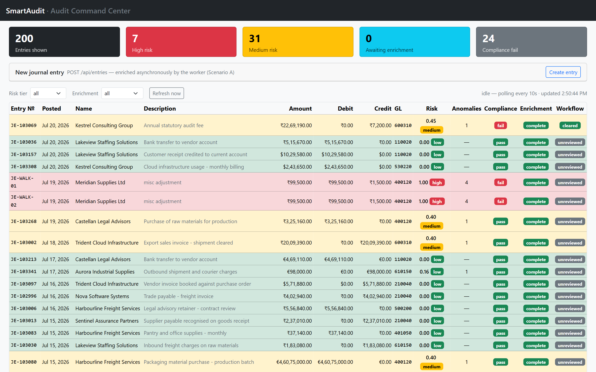
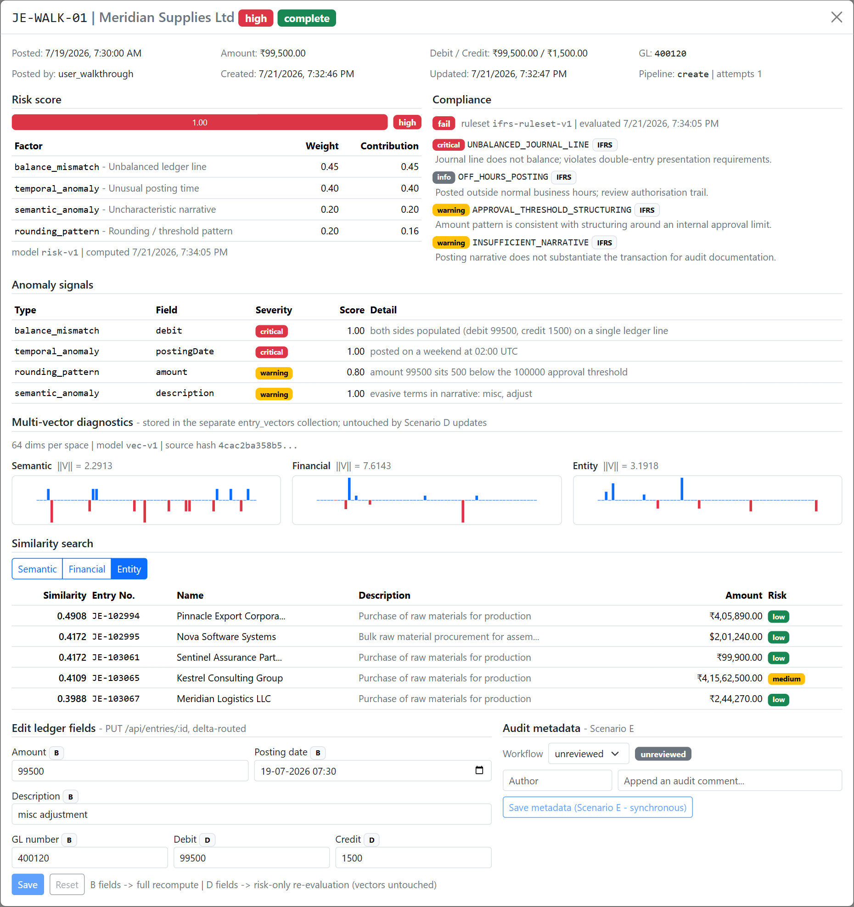
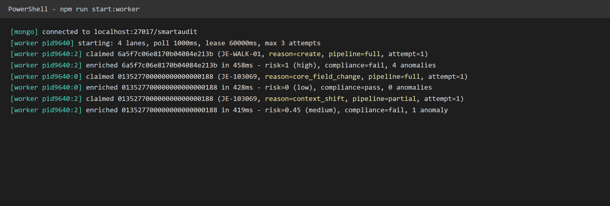

# SmartAudit — Intelligent Financial Audit Pipeline

An AI-enriched financial audit engine over a MongoDB journal ledger: entries are ingested through a REST API, enriched asynchronously by a background worker (risk scoring, granular anomaly detection, and three separate vector spaces), and explored through a React dashboard with a multi-vector diagnostics modal.

Built to the SmartAudit assessment specification. The [architecture decisions](#architecture-decisions) section below sets out each significant choice, the alternatives weighed against it, and the reasoning — including the trade-offs knowingly accepted. Section references (e.g. "spec §3.3") point into the assessment brief.

**Stack:** Node.js ≥ 20 · Express 5 · MongoDB 7 · Mongoose 8 · React 18 (class components) · Vite · Bootstrap 5. Plain JavaScript throughout — no TypeScript, no build step on the server.

---

## Contents

- [Quick start](#quick-start)
- [Environment configuration](#environment-configuration)
- [Commands](#commands)
- [Demo media](#demo-media)
- [API reference](#api-reference)
- [Architecture decisions](#architecture-decisions)
- [The five scenarios, and where each lives](#the-five-scenarios-and-where-each-lives)
- [Verification](#verification)
- [Deployment](#deployment)
- [Known trade-offs](#known-trade-offs)

---

## Quick start

### Before you start

Everything you need to install or have running, in full — there are no hidden steps and **no credentials, API keys or cloud accounts are required anywhere** in this project.

| | Requirement | Check it |
|---|---|---|
| 1 | **Node.js ≥ 20** — [nodejs.org](https://nodejs.org) | `node -v` |
| 2 | **Docker** — [Docker Desktop](https://www.docker.com/products/docker-desktop/), or any reachable MongoDB (see the note at the end of this section) | `docker -v` |
| 3 | **Docker Desktop actually running.** On Windows and macOS the daemon only runs while Desktop is open; `docker compose up -d` fails with a daemon-connection error otherwise. This is the most common first-run stumble. | `docker ps` returns without error |
| 4 | **Ports 3000, 4000 and 27017 free** — client, API and MongoDB respectively. All three are configurable; see [Port conflicts](#port-conflicts). | — |

### Run it

Four terminals from a clean clone.

```bash
git clone <repository-url>
cd smartaudit
```

**Terminal 1 — set up and seed:**

```bash
# 1. Install root, server and client dependencies
npm run setup

# 2. Configure — the defaults work as-is against the bundled Docker MongoDB
cp .env.example .env          # Windows cmd.exe: copy .env.example .env

# 3. Start MongoDB (single-node replica set; the initiate is idempotent)
docker compose up -d

# 4. Hydrate the ledger with 500 deterministic entries
npm run seed
```

**Terminals 2, 3 and 4** — one each. These are long-lived foreground processes: leave them running.

```bash
npm run start:server    # Express API on http://localhost:4000
npm run start:worker    # background enrichment worker (safe to run N of these)
npm run start:client    # dashboard on http://localhost:3000
```

Open <http://localhost:3000>.

> **The worker is not optional.** It is what performs enrichment; without it every entry stays at `enrichment.status: "pending"` forever and the dashboard shows no risk scores. If the ledger looks unscored, check terminal 3 first.

**When you're done:**

```bash
docker compose down       # stop MongoDB, keep the data volume
docker compose down -v    # ...or also delete the data (npm run seed rebuilds it)
```

### Port conflicts

| Port | Variable | If it's taken |
|---|---|---|
| 3000 | `CLIENT_PORT` | Change it in `.env`. The Vite dev server and its `/api` proxy both read it, so nothing else needs touching. |
| 4000 | `PORT` | Change it in `.env` — **and change `VITE_API_BASE_URL` to match**, since that is the proxy target the client forwards `/api` to. The two must move together. |
| 27017 | (in `docker-compose.yml` and `MONGODB_URI`) | A local `mongod` service or another Mongo container will block `docker compose up -d`. Stop it, or remap the port in `docker-compose.yml` and update `MONGODB_URI` to match. |

### Using MongoDB Atlas or a local mongod instead

Set `MONGODB_URI` and skip `docker compose` entirely. No code path requires transactions or change streams, so a plain standalone `mongod` works just as well as the bundled replica set.

---

## Environment configuration

Copy [`.env.example`](.env.example) to `.env`. Every variable the application reads is listed there; the defaults are the ones used for all verification below.

| Variable | Default | Purpose |
|---|---|---|
| `MONGODB_URI` | `mongodb://localhost:27017/smartaudit?replicaSet=rs0` | Connection string. Atlas or standalone `mongod` both work. |
| `PORT` | `4000` | Express API port. |
| `WORKER_POLL_INTERVAL_MS` | `1000` | How long a drained worker sleeps before re-polling for claimable jobs. |
| `WORKER_CONCURRENCY` | `4` | Parallel claim lanes inside one worker process. Each lane claims one job at a time via an atomic `findOneAndUpdate`, so lanes — and additional worker processes — can never double-claim. |
| `WORKER_LEASE_MS` | `60000` | Visibility timeout. A job still `processing` after this long is presumed orphaned by a crashed worker and becomes claimable again. |
| `WORKER_MAX_ATTEMPTS` | `3` | Poison-job cutoff: after this many claims a job is parked as `failed` with `lastError`. |
| `ENRICHMENT_DELAY_MS` | `400` | Simulated ML execution delay. **The spec mandates 400 ms for Scenario A.** |
| `MIGRATION_BATCH_SIZE` | `100` | Keyset page size for `migrate:models` / `reevaluate:risk`. Bounds memory during batch pagination. |
| `SEED_COUNT` | `500` | Entries generated by `npm run seed` (override per run with `--count`). |
| `SEED_RANDOM_SEED` | `20260720` | PRNG seed — the same value reproduces byte-identical data, including `_id`s. |
| `CLIENT_PORT` | `3000` | Vite dev server port. |
| `VITE_API_BASE_URL` | `http://localhost:4000` | Proxy target for `/api`. The browser only ever talks same-origin to the client port, so the server needs no CORS configuration. |

---

## Commands

All commands run from the repository root.

| Command | What it does |
|---|---|
| `npm run setup` | Installs root, `server/` and `client/` dependencies. |
| `npm run seed` | Drops and rebuilds both collections, then inserts `SEED_COUNT` deterministic entries at `enrichment.status: pending`. Prints a planted-cohort report (how many unbalanced / off-hours / outlier / near-duplicate rows it created) so detection output can be compared against a known answer. Flags: `--count`, `--seed`, `--enrich-historical`. |
| `npm run start:server` | Express API on `PORT`. |
| `npm run start:worker` | Enrichment worker: `WORKER_CONCURRENCY` poll-and-drain lanes. Safe to run several processes concurrently. |
| `npm run start:client` | Vite dev server on `CLIENT_PORT`. |
| `npm run migrate:models` | **Scenario C.** Keyset-paginates historical records stamped at a superseded model version and recomputes them to the current one. Flags: `--batch-size`, `--dry-run`. |
| `npm run reevaluate:risk` | **Scenario D (bulk).** Re-derives anomalies, risk and compliance for every settled entry via targeted `$set`, leaving vectors untouched. Flags: `--batch-size`. |
| `npm test` | Server test suite (`node --test`). 31 tests: claim concurrency, delta routing, migration, similarity. Requires MongoDB to be running. |

### Demonstrating the Scenario C migration end to end

`npm run seed` leaves entries unenriched, so there is nothing stale to migrate. To create genuinely stale historical data, seed with `--enrich-historical` — it runs the *real* enrichment service and stamps the results at the superseded versions (`risk-v0`, `vec-v0`):

```bash
npm run seed -- --enrich-historical    # 500 entries enriched at v0
npm run migrate:models -- --dry-run    # report what is stale, write nothing
npm run migrate:models                 # migrate v0 → v1 in keyset batches
```

The dashboard's diagnostics modal badges pre-migration vectors as **stale model**, and similarity results carry a `stale` flag — so the migration's effect is visible in the UI, not just in the log.

---

## Demo media

Captured against the running stack (`docs/media/`).

**1 · Dashboard** — risk-tier colour coding, per-entry anomaly counts, compliance and enrichment badges, and a freshly-created entry still `pending` while the worker is mid-flight. The header shows the adaptive poll ("worker active — polling every 2s").



**2 · Multi-vector diagnostics modal** — itemised risk factors with weights and contributions, IFRS compliance flags, granular anomaly signals naming both type *and* field, all three 64-dimension vector spaces with their L2 norms, and a live entity-strategy similarity search. The edit surface tags each field with the scenario it routes to (**B** = full recompute, **D** = risk-only).



**3 · Worker terminal during a recomputation loop** — one worker process handling, in order: a Scenario A create (`reason=create, pipeline=full`), a Scenario B core-field edit (`reason=core_field_change, pipeline=full`), and a Scenario D balance edit (`reason=context_shift, pipeline=partial`). A Scenario E metadata edit was issued between them and produces **no line at all** — it bypasses the queue entirely.



> The log image is a syntax-highlighted rendering of captured worker output, not a photo of a terminal window. The verbatim source is committed alongside it at [`docs/media/worker-recompute.txt`](docs/media/worker-recompute.txt) — the text in the image matches that file exactly.

---

## API reference

Base URL `http://localhost:4000`. The three paths marked **spec-fixed** are contractual; the others are additive conveniences for the dashboard and for verification.

| Method | Path | |
|---|---|---|
| `POST` | `/api/entries` | **spec-fixed** — Scenario A ingestion |
| `PUT` | `/api/entries/:id` | **spec-fixed** — delta-routed update (B / D / E) |
| `POST` | `/api/entries/search/similar` | **spec-fixed** — multi-space vector similarity |
| `GET` | `/api/entries` | list, `?limit&tier&status` |
| `GET` | `/api/entries/:id` | single entry |
| `GET` | `/api/entries/:id/vectors` | the three vector spaces, for the diagnostics modal |
| `GET` | `/health` | `{ ok: true }` |

### `POST /api/entries`

Accepts the spec's §2 baseline fields only — a whitelist, so `analytics`, `auditMeta` and `_id` are never writable through this door. Responds **201** with the persisted record at `analytics.enrichment.status: "pending"`: the contract is *accepted, will be enriched asynchronously*. Creating the entry **is** the enqueue (see below).

### `PUT /api/entries/:id`

Accepts only `amount`, `description`, `glNumber`, `postingDate` (→ **B**), `debit`, `credit` (→ **D**), and `auditMeta.workflowStatus` / `auditMeta.comment` (→ **E**). Any other key is a **400** naming the offending fields. Responds with the classification made explicit:

```jsonc
{
  "routing": {
    "scenario": "B",              // "B" | "D" | "E" | "no_op"
    "action": "core financial field changed — vectors, risk and anomalies invalidated; full recomputation queued",
    "changedFields": ["description"]
  },
  "entry": { /* the updated entry */ }
}
```

Classification is **diff-based**: re-sending a stored value changes nothing and routes to `no_op`. **409** means a concurrent content write landed between this request's read and its write (see the CAS below).

The Scenario E body shape, in full — `workflowStatus` is a closed enum and `comment` needs both fields:

```jsonc
{
  "auditMeta": {
    "workflowStatus": "in_review",              // unreviewed | in_review | cleared | escalated
    "comment": { "author": "j.rivera", "text": "Balance corrected." }
  }
}
```

Both keys are optional, but at least one must be present. Comments are **append-only** — the server stamps `at` and pushes; there is no edit or delete surface.

### `POST /api/entries/search/similar`

```jsonc
// request
{ "entryId": "013527700000000000000188", "strategy": "semantic" }  // semantic | financial | entity

// response
{
  "entryId": "013527700000000000000188",
  "strategy": "semantic",
  "results": [
    { "entryId": "…", "similarity": 0.9412, "stale": false, "entry": { /* … */ } }
    // top 5, descending, self excluded
  ]
}
```

`stale: true` marks a candidate whose vectors were computed by a superseded model version — visibly stale rather than silently comparable. **409** if the query entry has not been enriched yet (it has no vectors). A degenerate zero vector returns `results: []` rather than an error.

### Errors

Uniform shape `{ "error": "message" }`, plus `"details"` where useful (field-level validation messages, or the allowed values for a rejected enum). **400** malformed input · **404** unknown entry or route · **409** conflict (CAS miss, duplicate `entryNo`, or not-yet-enriched) · **500** unexpected.

---

## Architecture decisions

The choices that shaped this system, and why each was made over its alternatives.

### Two collections: the ledger, and the expensive layer

`entries` holds the 20 baseline fields from spec §2 verbatim, plus two sibling sub-documents: `analytics` (risk, compliance, anomaly signals, and enrichment pipeline state) and `auditMeta` (workflow status and auditor comments). The three vector spaces live in a **separate `entry_vectors` collection**, keyed by the entry's own `_id`, so the relationship is enforced by the primary key and the join is a PK hit.

The split falls exactly where the spec's own language divides: §3 says to *append* AI metadata to the baseline record, while the preamble says to *isolate core records from high-cost analytical layers*. The high-cost layer is specifically the vectors — 3 × 64 doubles ≈ 1.5 KB against a ~400-byte baseline record — while risk data is a handful of scalars read on the dashboard's hottest path.

The decisive consequence is Scenario D. "Leaves the large vector attributes entirely untouched" stops being a property that must be maintained carefully in every update, and becomes a property of the risk-update code path **holding no handle to the vectors model at all**: `PartialEvaluationService` imports neither `EntryVectors` nor its repository. Verification is then a fact about the vector document not changing, rather than a code review.

### The queue is the entry document

No broker, and no jobs collection. `analytics.enrichment` on the entry — `status` / `reason` / `attempts` / `claimedAt` / `completedAt` / `lastError` — **is** the queue state, served by a partial index that contains only in-flight jobs. Creating an entry and enqueueing its enrichment are therefore one atomic insert: a new entry is born `pending`, which is the claimable state, and there is no window in which an entry exists but its job does not.

BullMQ + Redis was the main alternative, and was rejected for a workload of this shape: it splits job truth across two stores with no arbiter (Redis says done, the Mongo write failed), adds a second infrastructure dependency to a local run, and outsources the race-condition mechanism — which the spec names as a primary discussion point — to a library. A separate `enrichment_jobs` collection was the more serious contender, rejected because job state is inherently 1:1 with an entry and a second collection reintroduces exactly the cross-collection consistency problem the schema design avoids, with no transaction permitted to patch it.

Dispatch is poll-and-drain rather than change streams, because change streams require a replica set and the system is deliberately correct on standalone `mongod` too.

**What this buys, beyond simplicity:** re-enqueue is an idempotent `$set` back to `pending`, so N rapid edits — or a double-clicked save — **coalesce into one recompute** rather than queueing N of them.

### Race conditions: atomic claim, lease, fenced writes, and a CAS on updates

Four mechanisms, all in the repository layer:

1. **Atomic claim.** One `findOneAndUpdate` filtering `status: pending ∨ (processing ∧ claimedAt < now − WORKER_LEASE_MS)`, setting `processing` / `claimedAt` and `$inc`-ing `attempts`. MongoDB's single-document atomicity makes double-claims impossible: racing claimants get different documents, or `null`.
2. **Lease (visibility timeout).** The stale-claim clause is crash recovery — a dead worker's job re-enters the claimable pool after `WORKER_LEASE_MS`. This is safe because every pipeline write is idempotent, and because enrichment commits by ordering rather than by transaction: vectors first, then a single write that lands analytics *and* flips the status to `complete`. That flip is the commit point; a crash mid-way leaves the entry re-claimable and no partial state is ever readable as complete.
3. **Fenced terminal writes.** Complete / release / fail all filter on `{ status: processing, claimedAt: mine }`. A zombie worker that outlived its lease misses the filter, and its write is discarded instead of clobbering the rightful owner's result.
4. **Optimistic CAS on updates.** `PUT` executes its whole plan — field `$set`s, auditMeta operations, and the re-enqueue flip — as **one** `updateOne` filtered on `{ _id, updated: <value read at plan time> }`. A miss means a concurrent content write landed in between; the service re-plans once from a fresh read, then returns **409**. Because queue bookkeeping deliberately never bumps `updated`, this CAS races only against genuine content edits, never against worker churn.

A Scenario B or D re-enqueue sets `status: pending` even mid-run, which breaks a running claim's fence — the now-stale result is discarded and the job re-claimed against the new content. That is mechanism 3 working in a second direction, not a new mechanism.

### Delta routing: one classifier, a closed taxonomy

`UpdatePlanner` is the single place scenario detection lives. It classifies a `PUT` diff against a **closed** field taxonomy and emits an immutable plan that the repository executes as one atomic write. A closed taxonomy means every accepted field has a defined meaning and anything else is a 400 — the classification is total, rather than a set of conditionals scattered across a service.

`debit` / `credit` route to **D**, not B, because the spec's Scenario B enumerates its invalidation set exhaustively ("`amount`, `description`, `glNumber`, or `postingDate`"). A balance edit changes the `balance_mismatch` signal, so risk and compliance must move — but by the spec's own list it does not invalidate the vectors, which is precisely Scenario D's premise.

The `routing` block is returned in the response so the decision is API-observable rather than inferred from logs — and the dashboard reads `routing.scenario` to decide what to expect, instead of re-deriving the classification client-side.

### Similarity: streaming cosine over precomputed norms

`POST /api/entries/search/similar` is a tenant-scoped streaming scan of `entry_vectors`, projected to a **single space** per candidate (about a third of each document) plus its precomputed L2 norm. Cosine then reduces to a dot product divided by two stored scalars, and a fixed 5-slot insertion table keeps the top-K — memory is bounded by the cursor batch regardless of collection size, and nothing accumulates. The strategy string only selects which array participates; there are not three code paths.

Aggregation-pipeline dot products (`$zip` / `$reduce`) cannot maintain a running top-K and are unreadable; Atlas `$vectorSearch` would break local-Docker parity. `entry_vectors` is the documented seam where a real vector store would replace this scan wholesale.

### Migration: keyset pages, guarded writes, the version stamp as checkpoint

`migrate:models` pages with `{ modelVersion: v, status: complete, _id > lastId }` sorted by `_id` ascending — equality plus range riding a compound index, with zero skipped-and-scanned rows. **`.skip()` appears nowhere in the codebase**; it is both spec-prohibited and O(n²) in scan work.

Each entry's two writes are **guarded**: vectors are replaced only while still stamped at a superseded version, and analytics `$set` only while the stale version is still in place. So a concurrent worker restamp can never be clobbered (its content is at least as fresh), a crash between the two writes re-converges on the next run, and re-running the whole migration is a no-op. **The version stamp is itself the checkpoint** — there is no state file to corrupt or resume from.

A long-lived `find().cursor()` stream would also be literally "cursor pagination", but it can time out mid-migration and is not resumable; stateless keyset batches are the stronger answer to *"without exhausting database memory limits"*.

### Frontend: class components, and a UI that mirrors the backend's guarantees

Every component in `client/src` is a `React.Component` class — no hooks, no function components anywhere, including small presentational pieces. Bootstrap is used as **CSS only**, deliberately not `react-bootstrap`, whose components are internally function components using hooks.

**Reflecting asynchronous enrichment.** Because the queue state lives on the entry document, re-fetching entries *is* reading the queue — there is no separate job API to reconcile against. The dashboard runs a `setTimeout` chain (not `setInterval`, so a slow response can never overlap the next tick) started in `componentDidMount` and cleared in `componentWillUnmount`, adapting its cadence: **2 s** while any visible entry is `pending`/`processing`, **10 s** once everything is settled. The open modal polls the single entry on the same rule and refetches vectors when enrichment completes.

**Guarding the double-click / concurrent-save race**, mirroring the backend rather than duplicating it:

- **Disable-while-saving** — the spec's "sequential double-clicks on save actions". Pure UX suppression; a click that slips through is harmless anyway, because the backend diffs an identical re-send to `no_op` and coalesces re-enqueues.
- **Dirty-fields-only PUT** — the form diffs against the entry snapshot and sends only changed keys, matching the planner's diff-based contract and keeping `routing.changedFields` meaningful.
- **409 means reload, never blind retry** — on a CAS conflict the form refetches the entry, resets to server truth, and tells the auditor to re-apply. The server is the arbiter; the UI never re-submits a write the server just rejected.

---

## The five scenarios, and where each lives

| Scenario | Behaviour | Implementation |
|---|---|---|
| **A** — Real-time ingestion | `POST /api/entries` returns immediately; a worker enriches asynchronously after the mandated 400 ms delay | `EntryService.create` (insert *is* enqueue) → `EnrichmentWorker` → `EnrichmentService` |
| **B** — Core ledger modification | Editing `amount`/`description`/`glNumber`/`postingDate` invalidates everything; full recompute queued | `UpdatePlanner` → `reason: core_field_change` → full pipeline (vectors + risk) |
| **C** — Model upgrade | CLI keyset-pages stale historical records to the current model version | `npm run migrate:models` → `ModelMigrationService` + `KeysetPager` |
| **D** — Regulatory / threshold shift | Risk, compliance and anomalies re-derived; **vectors untouched** | `PartialEvaluationService` (imports no vectors handle) — per-entry via `reason: context_shift`, in bulk via `npm run reevaluate:risk` |
| **E** — Audit log update | Comment or workflow-status change saved synchronously; queue bypassed entirely | `UpdatePlanner` → scenario `E` → one atomic write, no enqueue |

---

## Verification

`npm test` runs 31 tests covering claim concurrency, delta routing, migration exactness, and similarity. Beyond the suite, the following were verified live against the running stack:

- **Claim safety.** 40 concurrent claimants over 20 jobs produced pairwise-disjoint claims with every `attempts === 1`. Two 4-lane worker processes drained 500 seeded jobs with zero overlap. A hard-killed worker's orphaned claims were reclaimed after lease expiry and completed by a second worker.
- **Scenario D really is vector-free.** A balance edit re-scored risk from 0.00 to 0.45 while the entry's vector document stayed **byte-identical** (SHA-256 equal before and after). The very next edit — a `description` change, routed to B — moved both. A full `reevaluate:risk` run over 501 entries left the entire `entry_vectors` collection unchanged.
- **Scenario C.** A 500-entry `v0` fixture migrated to `v1` in five keyset batches of 100 (3.5 s), re-running the migration was a no-op, and the guarded writes were confirmed not to clobber a simulated concurrent restamp. A `--batch-size=7` run over the same data paged exactly once per record.
- **Double-click.** Two independent PUTs carrying identical bodies produced `routing.scenario: "B"` followed by `"no_op"` — the second wrote nothing, queued nothing, and needed no UI cooperation to be harmless. The dashboard's disable-while-saving guard sits on top of this, not in place of it.
- **Concurrent save under contention.** Parallel writer loops hammering a single entry recorded 386 responses, of which **14 were 409** — the CAS declining to lose an update — while the rest succeeded. The entry settled at `status: complete, attempts: 1`, with no interleaved write producing a lost update or a stuck job.
- **The 409 reload path in the UI.** The server's 409 under contention is real (above); the *UI branch* was exercised by injecting a 409 response into a single save, since reproducing a natural CAS miss against a specific browser click is inherently timing-dependent. On receiving it the form surfaced *"This entry changed on the server…"*, refetched, and reset its fields to the server's current values rather than retrying.
- **Two-tab concurrent edit.** Two browser tabs holding the same entry open: one saved a `glNumber` change, then the other — whose snapshot was two writes stale — saved a `description` change. The second save was accepted with the correct `B` routing, and the form re-synchronised to the server's merged state, since the two edits touched disjoint fields and each PUT re-plans from a fresh read.

---

## Deployment

The app deploys as a **single web service**: Express serves the API and the built client from one origin (so no CORS is involved), with MongoDB Atlas behind it.

```bash
npm run setup && npm run build    # build command
npm run start:server              # start command
```

Required environment variables in the host's dashboard:

| Variable | Value |
|---|---|
| `MONGODB_URI` | Your Atlas SRV connection string |
| `RUN_WORKER_IN_PROCESS` | `true` |
| `NODE_VERSION` | `20` (or higher) |

`PORT` is supplied by the host and read automatically.

**On `RUN_WORKER_IN_PROCESS`:** free single-instance hosting gives you one process, so this flag lets the web service also run the enrichment worker. It is a deployment accommodation, not a change of architecture — the worker is the same `EnrichmentWorker` class built by the same `WorkerFactory`, and `npm run start:worker` still runs it as an independent process (which is how it runs locally, and how it would run in production on a platform with a worker tier). Because claiming is an atomic `findOneAndUpdate`, adding more worker processes later needs no code change.

Seed the deployed database once from your machine, pointing at Atlas:

```bash
MONGODB_URI="<atlas-uri>" npm run seed
# PowerShell: $env:MONGODB_URI="<atlas-uri>"; npm run seed
```

## Known trade-offs

Recorded deliberately rather than left as surprises.

- **Semantic ties can crowd out near-duplicates.** The seed draws descriptions from a small template pool, so many same-company entries share identical normalised text and tie at cosine exactly 1.0; the fixed 5-slot table keeps whichever ties it encounters first. This is the semantic space behaving correctly — identical text *is* maximally semantically similar, and distinguishing same-text entries by vendor is precisely the `entity` strategy's job. Re-ranking ties to favour seed-cluster members would mean overfitting retrieval to the answer key. **Use a distinctive-description entry, or the `entity` strategy, when demonstrating duplicate detection.**
- **After a Scenario D edit, the financial vector reflects the pre-edit balance.** The financial space's feature extractor does read `debit`/`credit`, but the spec's exhaustive Scenario B list — not the feature extractor — defines the invalidation contract. Accepted explicitly; a `description`/`amount`/`glNumber`/`postingDate` edit recomputes both halves.
- **No per-run job history.** Because the entry document *is* the job record, only latest-attempt state plus `lastError` is retained. A separate history collection would be the addition if audit trails over pipeline runs were required.
- **Comments are append-only.** There is no edit or delete surface for auditor comments — out of scope for the spec's audit-log scenario, and arguably correct for an audit trail regardless.
- **`GET /api/entries` has no pagination**, only `?limit` (default 50, capped 200). The dashboard is a demonstration surface over a 500-row seed; a production ledger view would need keyset pagination here too — the machinery already exists in `KeysetPager`.
